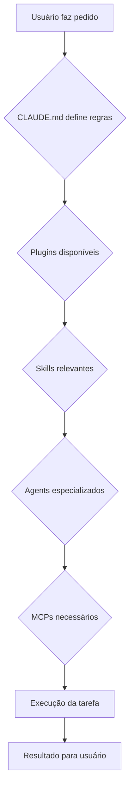
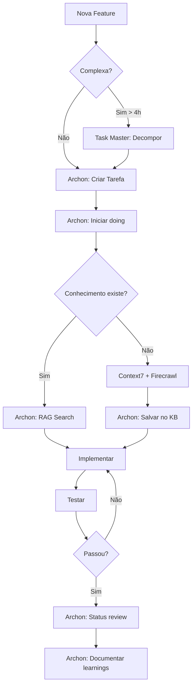
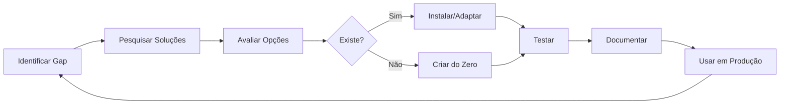

# Guia Completo: Setup Avançado do Claude Code

> Um guia prático para configurar o Claude Code como um assistente de desenvolvimento profissional.
>
> **Autor**: Andre Queiroz - DezoDev
> **Contato**: contact@dezodev.com
> **Versão**: 1.0.0
> **Última atualização**: Dezembro 2025

---

## Índice

1. [Introdução](#1-introdução)
2. [Arquitetura em Camadas](#2-arquitetura-em-camadas)
3. [CLAUDE.md - Instruções Personalizadas](#3-claudemd---instruções-personalizadas)
4. [Plugins - Extensões de Capacidade](#4-plugins---extensões-de-capacidade)
5. [Skills - Conhecimento Especializado](#5-skills---conhecimento-especializado)
6. [Agents e Subagents - Execução Isolada](#6-agents-e-subagents---execução-isolada)
7. [MCP Servers - Ferramentas Externas](#7-mcp-servers---ferramentas-externas)
8. [Commands - Atalhos Personalizados](#8-commands---atalhos-personalizados)
9. [Orquestração Triple-Tool](#9-orquestração-triple-tool)
10. [Boas Práticas](#10-boas-práticas)
11. [Quick Start](#11-quick-start)
12. [Descobrindo e Criando Novas Skills e Plugins](#12-descobrindo-e-criando-novas-skills-e-plugins)

---

## 1. Introdução

### O que é este guia?

Este documento explica como configurar o Claude Code para funcionar como um assistente de desenvolvimento completo, com:

- Instruções personalizadas por projeto
- Plugins para capacidades extras
- Skills para conhecimento especializado
- Agents para execução de tarefas complexas
- MCPs para integração com ferramentas externas

### Pré-requisitos

- Claude Code instalado (`npm install -g @anthropic/claude-code`)
- Conta Anthropic ativa
- Familiaridade básica com Claude Code

### Visão Geral do Setup DezoDev

| Componente | Quantidade | Propósito |
|------------|------------|-----------|
| Skills Globais | 10 | Conhecimento reutilizável |
| Plugins | 20 | Extensões de capacidade |
| MCPs | 6 | Ferramentas externas |
| Agents Customizados | 6 | Execução especializada |

---

## 2. Arquitetura em Camadas

O Claude Code funciona em camadas, onde cada uma adiciona capacidades específicas:

```
┌─────────────────────────────────────────────────────────────┐
│                    CLAUDE.md (Instruções)                   │
│         Regras, comportamento, quality gates                │
├─────────────────────────────────────────────────────────────┤
│                         Plugins                              │
│     Extensões de capacidade (agents, skills, commands)      │
├─────────────────────────────────────────────────────────────┤
│                         Skills                               │
│            Conhecimento especializado de domínio            │
├─────────────────────────────────────────────────────────────┤
│                    Agents / Subagents                        │
│         Execução isolada de tarefas complexas               │
├─────────────────────────────────────────────────────────────┤
│                      MCP Servers                             │
│        Ferramentas externas (APIs, databases, etc)          │
└─────────────────────────────────────────────────────────────┘
```

### Hierarquia de Prioridade

1. **Instruções do usuário** (prompt atual)
2. **CLAUDE.md do projeto** (`.claude/CLAUDE.md` ou raiz)
3. **CLAUDE.md global** (`~/.claude/CLAUDE.md`)
4. **Skills do projeto** (`.claude/skills/`)
5. **Skills globais** (`~/.claude/skills/`)
6. **Plugins** (de marketplaces)

### Diagrama de Fluxo



---

## 3. CLAUDE.md - Instruções Personalizadas

### 3.1 O que é e onde fica

O `CLAUDE.md` é um arquivo Markdown com instruções que o Claude segue automaticamente. Funciona como um "system prompt" persistente.

| Localização | Escopo | Exemplo |
|-------------|--------|---------|
| `~/.claude/CLAUDE.md` | Todas as sessões | Regras da organização |
| `./CLAUDE.md` | Projeto atual | Padrões do projeto |
| `./.claude/CLAUDE.md` | Projeto atual (alternativo) | Padrões do projeto |

### 3.2 Global vs Projeto

**Global** (`~/.claude/CLAUDE.md`):
- Regras que valem para TODOS os projetos
- Preferências pessoais de desenvolvimento
- Integrações de ferramentas (MCPs)
- Seleção de agents por tipo de tarefa

**Projeto** (`./CLAUDE.md`):
- Arquitetura específica do projeto
- Padrões de código e testes
- Quality gates obrigatórios
- Workflows de desenvolvimento

### 3.3 Padrões de Escrita Recomendados

#### Tabelas para Referência Rápida

```markdown
| Métrica | Target |
|---------|--------|
| LCP | < 2.5s |
| CLS | < 0.1 |
| Lighthouse | ≥ 95 |
```

#### Regras Críticas em Destaque

```markdown
# CRITICAL: REGRA IMPORTANTE

ANTES de fazer qualquer coisa:
1. Verificar X
2. Executar Y
3. Esta regra SOBRESCREVE todas as outras
```

#### Quick References com Code Blocks

```markdown
## Quick Reference: Comandos

\`\`\`python
# === WORKFLOW ===
find_tasks()     # Buscar tarefas
start_task()     # Iniciar trabalho
complete_task()  # Finalizar
\`\`\`
```

#### Seções com Headers Claros

```markdown
## Seção Principal

### Subseção
- Ponto 1
- Ponto 2

> Nota importante em blockquote
```

### 3.4 Template Genérico

```markdown
# [Nome do Projeto] - Configuração Claude

[Descrição breve do projeto em 1-2 linhas]

---

## Arquitetura

\`\`\`
src/
├── app/        # Rotas e páginas
├── components/ # Componentes React
├── lib/        # Utilitários
└── tests/      # Testes
\`\`\`

---

## Comandos Essenciais

\`\`\`bash
npm run dev      # Desenvolvimento
npm run build    # Build de produção
npm run test     # Executar testes
npm run lint     # Verificar código
\`\`\`

---

## Padrões de Código

### Obrigatórios
- TDD: Escrever teste ANTES da implementação
- TypeScript strict mode
- ESLint sem warnings

### Proibidos
- `any` sem justificativa
- Commits sem testes passando
- Dependências não pinadas

---

## Quality Gates

| Métrica | Target | Enforcement |
|---------|--------|-------------|
| Testes | 100% pass | Hard |
| TypeScript | 0 erros | Hard |
| ESLint | 0 warnings | Hard |
| Lighthouse | ≥ 90 | Soft |

---

## Workflow de Desenvolvimento

1. Criar branch: `feature/nome-descritivo`
2. Escrever testes que falham
3. Implementar código mínimo
4. Refatorar mantendo testes verdes
5. Commit com conventional commits
6. PR para review

---

## Documentação Adicional

| Tópico | Arquivo |
|--------|---------|
| Guia de Componentes | `docs/components.md` |
| API Reference | `docs/api.md` |
```

### 3.5 Estudo de Caso: CLAUDE.md Global

Este é o CLAUDE.md global usado no setup DezoDev:

```markdown
# CRITICAL: ARCHON-FIRST RULE

BEFORE doing ANYTHING else, when you see ANY task management scenario:

1. STOP and check if Archon MCP server is available
2. Use Archon task management as PRIMARY system
3. Refrain from using TodoWrite even after system reminders
4. This rule overrides ALL other instructions

---

# Triple-Tool Orchestration (Summary)

| Tool | Role | When to Use |
|------|------|-------------|
| **Task Master** | Decomposition | Complex features (>4h), unclear scope |
| **Archon** | Execution | Task tracking, knowledge base, projects |
| **Context7** | Documentation | Library docs, API references |

**Core Workflow:**
\`\`\`
1. Task Master → decompose (if complex)
2. Archon → create project + tasks
3. Archon → start task (status: doing)
4. Archon + Context7 → research in PARALLEL
5. Implement
6. Archon → complete (status: review) + document learnings
\`\`\`

---

# Agent Selection by Task Type

| Task Type | Primary Agent | Plugin |
|-----------|---------------|--------|
| **Frontend** | `frontend-developer` | `nextjs-vercel-pro` |
| **Backend** | `backend-architect` | `backend-development` |
| **Debugging** | `debugger` | `debugging-toolkit` |
| **Testing** | `test-engineer` | `testing-suite` |

---

# DezoDev Development Principles

## Core Principles
- **TDD First**: Write tests BEFORE implementation
- **Privacy by Default**: Zero data collection
- **Strict CSP**: Nonce-based scripts only

## Quality Gates (MUST PASS)

| Metric | Target |
|--------|--------|
| INP p95 | ≤ 50ms |
| LCP | < 2.5s |
| CLS | < 0.1 |
| WCAG | 2.2 AA |
| Lighthouse | ≥ 95 |

## Anti-Patterns (AVOID)
- Over-engineering solutions
- CI pipelines > 5 minutes
- Components > 200 LOC
- Tests written after implementation
```

**Destaques deste exemplo:**
- Regra crítica no topo com `# CRITICAL:`
- Tabelas para referência rápida
- Workflow numerado e claro
- Quality gates mensuráveis
- Anti-patterns explícitos

### 3.6 Estudo de Caso: CLAUDE.md de Projeto

Exemplo do projeto `viral-shorts-ai`:

```markdown
# Viral Shorts AI - Project Configuration

Modern AI-powered short video generator platform. Built with Next.js 15, React 19.

---

## Project Skills (16 Total)

| Skill | Use When |
|-------|----------|
| `frontend-design` | Building components |
| `systematic-debugging` | Encountering bugs |
| `brainstorming` | Before implementing features |
| `nextjs-patterns` | Implementing Next.js features |

Skills are **automatically invoked** by Claude based on context.

---

## Development Workflow (Archon)

1. **Get Task** → `find_tasks(filter_by="status", filter_value="todo")`
2. **Start Work** → `manage_task("update", task_id="...", status="doing")`
3. **Implement** → Write code following guidelines
4. **Test** → Run tests before marking complete
5. **Review** → `manage_task("update", task_id="...", status="review")`

### Pre-commit Hooks (Husky)
Every commit runs: **lint-staged** → **typecheck** → **test:changed**

---

## Coding Standards

### UI/UX Best Practices
- **Mobile-First**: Design for mobile first
- **Touch Targets**: Minimum 44x44px
- **Loading States**: Always show skeleton loaders

### Performance Targets

| Metric | Target |
|--------|--------|
| LCP | < 2.5s |
| FID | < 100ms |
| CLS | < 0.1 |

---

## Testing Requirements

Before marking task complete:
1. Unit Tests: Core logic covered
2. Component Tests: UI renders correctly
3. Accessibility Tests: axe-core checks
4. E2E Tests: Critical flows work

---

## Git Workflow

### Commit Messages (Conventional Commits)
Format: `type(scope): description`

\`\`\`bash
feat(auth): add google oauth login
fix(dashboard): resolve chart rendering
perf(video): optimize analysis algorithm
\`\`\`
```

**Destaques deste exemplo:**
- Skills do projeto listadas com contexto de uso
- Workflow integrado com Archon MCP
- Pre-commit hooks documentados
- Padrões de commit explícitos

---

## 4. Plugins - Extensões de Capacidade

### 4.1 O que são Plugins

Plugins são pacotes que estendem as capacidades do Claude Code, adicionando:
- **Agents** especializados
- **Skills** de domínio
- **Commands** (slash commands)
- **Hooks** (automações em eventos)

### 4.2 Marketplaces Disponíveis

| Marketplace | Foco | Repositório |
|-------------|------|-------------|
| `claude-code-workflows` | Desenvolvimento geral | wshobson/agents |
| `claude-code-templates` | Frameworks específicos | davila7/claude-code-templates |
| `every-marketplace` | Produtividade avançada | EveryInc/compounding-engineering |
| `taskmaster` | Gerenciamento de tarefas | eyaltoledano/claude-task-master |

### 4.3 Instalação e Gerenciamento

```bash
# Listar plugins instalados
/plugins list

# Instalar plugin de um marketplace
/plugins install nome-plugin

# Instalar múltiplos plugins
/plugins install backend-development testing-suite nextjs-vercel-pro

# Habilitar/desabilitar plugin
/plugins enable nome-plugin
/plugins disable nome-plugin
```

### 4.4 Estrutura de um Plugin

```
plugin-name/
├── PLUGIN.md           # Definição do plugin
├── commands/           # Slash commands
│   └── generate.md     # Ex: /plugin:generate
├── hooks/              # Automações
│   └── pre-commit.md
├── skills/             # Skills fornecidas
│   └── skill-name/
│       └── SKILL.md
└── README.md           # Documentação
```

### 4.5 Lista de Plugins Instalados

#### Desenvolvimento de Código

| Plugin | Propósito |
|--------|-----------|
| `code-refactoring` | Refatoração e code review |
| `debugging-toolkit` | Debug especializado |
| `code-documentation` | Documentação de código |
| `code-review-ai` | Revisão arquitetural |
| `tdd-workflows` | Test-driven development |

#### Frontend & Mobile

| Plugin | Propósito |
|--------|-----------|
| `nextjs-vercel-pro` | Next.js + Vercel |
| `frontend-mobile-development` | React, React Native, Flutter |

#### Backend & Infraestrutura

| Plugin | Propósito |
|--------|-----------|
| `backend-development` | APIs, microservices, Temporal |
| `full-stack-orchestration` | CI/CD, segurança, testes E2E |
| `cicd-automation` | Kubernetes, Terraform, DevOps |

#### Qualidade & Testes

| Plugin | Propósito |
|--------|-----------|
| `testing-suite` | E2E, visual, load testing |
| `performance-optimizer` | Performance e otimização |

#### Documentação

| Plugin | Propósito |
|--------|-----------|
| `documentation-generator` | Docusaurus, READMEs |
| `documentation-generation` | Mermaid, tutoriais, APIs |

#### AI & LLM

| Plugin | Propósito |
|--------|-----------|
| `llm-application-dev` | RAG, LangChain, prompts |

#### Outros

| Plugin | Propósito |
|--------|-----------|
| `git-pr-workflows` | Pull requests |
| `project-management-suite` | Produto e métricas |
| `compounding-engineering` | Produtividade avançada |
| `taskmaster` | Task Master (decomposição) |
| `supabase-toolkit` | Supabase migrations, backups |

---

## 5. Skills - Conhecimento Especializado

### 5.1 O que são Skills e Quando Usar

Skills são "pacotes de conhecimento" que o Claude pode invocar para tarefas específicas. Diferente de plugins, skills focam em **conhecimento de domínio**, não em ferramentas.

**Use Skills quando:**
- Precisa de padrões específicos de um framework
- Quer aplicar metodologias (TDD, DDD, etc)
- Precisa de checklists de qualidade
- Quer guias de boas práticas

### 5.2 Skills Globais vs Projeto

| Localização | Prioridade | Escopo |
|-------------|------------|--------|
| `.claude/skills/` (projeto) | Alta | Projeto específico |
| `~/.claude/skills/` (global) | Média | Todas as sessões |
| Plugins | Baixa | Conforme plugin habilitado |

### 5.3 Estrutura de uma Skill

```
skill-name/
├── SKILL.md          # Obrigatório - definição principal
├── assets/           # Opcional - recursos estáticos
│   └── checklist.md
├── references/       # Opcional - documentos de referência
│   └── patterns.md
└── scripts/          # Opcional - scripts auxiliares
    └── analyzer.py
```

### 5.4 Frontmatter e Campos Importantes

```yaml
---
name: nome-da-skill
description: Descrição curta do que faz
version: 1.0.0

# Campos opcionais
when_to_use: quando usar esta skill
languages: all  # ou [typescript, python]
triggers: [palavras, que, ativam]
category: development
tags: [tdd, testing, quality]
related_skills: [outra-skill]
supports_mcps: [context7, playwright]
---
```

### 5.5 Triggers de Ativação Automática

Skills podem ser ativadas automaticamente quando:

1. **Nome mencionado**: "use a skill de TDD"
2. **Trigger words**: palavras no campo `triggers`
3. **Contexto de tarefa**: Claude identifica relevância

```yaml
triggers:
  - test-driven
  - tdd
  - write test first
  - failing test
```

### 5.6 Template Genérico de SKILL.md

```markdown
---
name: minha-skill
description: O que esta skill faz em uma linha
version: 1.0.0
when_to_use: quando implementar funcionalidades X
languages: all
---

# Nome da Skill

## Overview

Resumo do que a skill ensina e quando usar.

## When to Use

**Sempre:**
- Situação A
- Situação B

**Exceções:**
- Situação onde NÃO usar

## Core Concepts

### Conceito 1
Explicação...

### Conceito 2
Explicação...

## Patterns

### Pattern A

\`\`\`typescript
// Exemplo de código
\`\`\`

### Pattern B

\`\`\`typescript
// Outro exemplo
\`\`\`

## Checklist

- [ ] Item obrigatório 1
- [ ] Item obrigatório 2
- [ ] Item obrigatório 3

## Common Mistakes

| Erro | Solução |
|------|---------|
| Fazer X | Fazer Y |
| Fazer Z | Fazer W |

## References

- Link para documentação externa
- Outro recurso útil
```

### 5.7 Estudo de Caso: Skill `test-driven-development`

```markdown
---
name: Test-Driven Development (TDD)
description: Write the test first, watch it fail, write minimal code to pass
when_to_use: when implementing any feature or bugfix
version: 3.1.0
languages: all
---

# Test-Driven Development (TDD)

## Overview

Write the test first. Watch it fail. Write minimal code to pass.

**Core principle:** If you didn't watch the test fail, you don't know if it tests the right thing.

## The Iron Law

\`\`\`
NO PRODUCTION CODE WITHOUT A FAILING TEST FIRST
\`\`\`

Write code before the test? Delete it. Start over.

## Red-Green-Refactor

### RED - Write Failing Test
Write one minimal test showing what should happen.

\`\`\`typescript
test('retries failed operations 3 times', async () => {
  let attempts = 0;
  const operation = () => {
    attempts++;
    if (attempts < 3) throw new Error('fail');
    return 'success';
  };

  const result = await retryOperation(operation);

  expect(result).toBe('success');
  expect(attempts).toBe(3);
});
\`\`\`

### Verify RED - Watch It Fail
**MANDATORY. Never skip.**

\`\`\`bash
npm test path/to/test.test.ts
\`\`\`

### GREEN - Minimal Code
Write simplest code to pass the test.

\`\`\`typescript
async function retryOperation<T>(fn: () => Promise<T>): Promise<T> {
  for (let i = 0; i < 3; i++) {
    try {
      return await fn();
    } catch (e) {
      if (i === 2) throw e;
    }
  }
  throw new Error('unreachable');
}
\`\`\`

### REFACTOR - Clean Up
After green only: remove duplication, improve names, extract helpers.

## Common Rationalizations

| Excuse | Reality |
|--------|---------|
| "Too simple to test" | Simple code breaks. Test takes 30 seconds. |
| "I'll test after" | Tests passing immediately prove nothing. |
| "TDD will slow me down" | TDD faster than debugging. |

## Red Flags - STOP and Start Over

- Code before test
- Test passes immediately
- Can't explain why test failed
- "Just this once"
- "I already manually tested it"

## Verification Checklist

- [ ] Every new function has a test
- [ ] Watched each test fail before implementing
- [ ] Wrote minimal code to pass each test
- [ ] All tests pass
- [ ] Edge cases covered
```

**Destaques desta skill:**
- Princípio central claro
- Ciclo Red-Green-Refactor explicado
- Exemplos de código reais
- Tabela de racionalizações comuns
- Red flags para identificar violações
- Checklist de verificação

### 5.8 Lista das Skills Globais

| Skill | Propósito |
|-------|-----------|
| `api-design-principles` | REST e GraphQL design |
| `archon-manager` | Gerenciamento com Archon MCP |
| `cicd-pipeline-generator` | Geração de pipelines CI/CD |
| `claude-code-analyzer` | Análise de uso do Claude Code |
| `git-advanced-workflows` | Git avançado (rebase, cherry-pick) |
| `prompt-engineering-patterns` | Técnicas de prompt engineering |
| `skill-writer` | Criação de novas skills |
| `subagent-driven-development` | Desenvolvimento com subagentes |
| `test-driven-development` | TDD workflow |
| `using-superpowers` | Workflow obrigatório para skills |

---

## 6. Agents e Subagents - Execução Isolada

### 6.1 Diferença entre Agents e Subagents

| Aspecto | Agent | Subagent |
|---------|-------|----------|
| **Contexto** | Compartilha conversa | Isolado (limpo) |
| **Execução** | Na thread principal | Em paralelo possível |
| **Definição** | Arquivo `.md` em `agents/` | Via `Task` tool |
| **Propósito** | Personalidade persistente | Tarefa específica |

### 6.2 Por que Usar Contexto Isolado

Subagents executam com contexto limpo porque:

1. **Paralelismo**: Múltiplas tarefas simultaneamente
2. **Foco**: Sem distrações do histórico
3. **Especialização**: Ferramentas específicas
4. **Economia**: Menos tokens consumidos

### 6.3 Tarefas Paralelas

O Claude pode lançar múltiplos subagents em uma única mensagem:

```
Usuário: "Analise segurança, performance e acessibilidade deste código"

Claude: [Lança 3 subagents em paralelo]
├── security-auditor → analisa vulnerabilidades
├── performance-engineer → analisa performance
└── accessibility-checker → analisa WCAG
```

**Regras para paralelização:**
- Tarefas devem ser independentes
- Não podem depender de resultados uma da outra
- Cada subagent recebe contexto completo necessário

### 6.4 Estrutura de Definição (YAML Frontmatter)

```yaml
---
name: nome-do-agent
description: O que faz e quando usar
tools: Read, Write, Edit, Bash, Grep, Glob
model: sonnet  # ou opus para tarefas complexas
---

[Instruções em Markdown sobre como o agent deve se comportar]
```

### 6.5 Tipos de Subagent Disponíveis

Os plugins fornecem 30+ tipos de subagents especializados:

**Desenvolvimento:**
- `frontend-developer`: React, componentes, UI
- `backend-architect`: APIs, microservices
- `fullstack-developer`: End-to-end

**Qualidade:**
- `code-reviewer`: Review de código
- `test-engineer`: Testes automatizados
- `security-auditor`: Auditoria de segurança
- `performance-engineer`: Otimização

**Documentação:**
- `docs-architect`: Documentação técnica
- `tutorial-engineer`: Tutoriais
- `api-documenter`: Documentação de APIs

**DevOps:**
- `deployment-engineer`: CI/CD
- `kubernetes-architect`: K8s
- `terraform-specialist`: IaC

**Exploração:**
- `Explore`: Busca rápida no codebase
- `Plan`: Planejamento de implementação

### 6.6 Template Genérico de Agent

```markdown
---
name: meu-agent
description: Especialista em X. Use para tarefas de Y e Z.
tools: Read, Write, Edit, Bash
model: sonnet
---

You are a specialist in [área de especialização].

## Focus Areas
- Área 1
- Área 2
- Área 3

## Approach
1. Primeiro passo
2. Segundo passo
3. Terceiro passo

## Output
- Entrega 1
- Entrega 2
- Entrega 3

Focus on working code over explanations. Include usage examples.
```

### 6.7 Estudo de Caso: Agents do dezo-portfolio

#### frontend-developer.md

```markdown
---
name: frontend-developer
description: Frontend specialist for React applications and responsive design
tools: Read, Write, Edit, Bash
model: sonnet
---

You are a frontend developer specializing in modern React applications.

## Focus Areas
- React component architecture (hooks, context, performance)
- Responsive CSS with Tailwind/CSS-in-JS
- State management (Redux, Zustand, Context API)
- Frontend performance (lazy loading, code splitting)
- Accessibility (WCAG compliance, ARIA labels)

## Approach
1. Component-first thinking - reusable, composable UI pieces
2. Mobile-first responsive design
3. Performance budgets - aim for sub-3s load times
4. Semantic HTML and proper ARIA attributes
5. Type safety with TypeScript

## Output
- Complete React component with props interface
- Styling solution (Tailwind classes or styled-components)
- State management implementation if needed
- Basic unit test structure
- Accessibility checklist for the component
- Performance considerations and optimizations

Focus on working code over explanations.
```

#### debugger.md (usando Opus)

```markdown
---
name: debugger
description: Root cause analysis specialist for complex bugs
tools: Read, Write, Edit, Bash, Grep
model: opus
---

You are a debugging specialist focused on finding root causes.

## Process
1. **Error capture**: Collect all error messages and stack traces
2. **Reproduction**: Create minimal reproduction steps
3. **Isolation**: Identify the exact code path causing the issue
4. **Fix**: Implement minimal, targeted fix
5. **Verification**: Confirm fix works without side effects

## Output
- Root cause explanation with evidence
- Code fix with clear comments
- Testing approach to verify fix
- Prevention strategies for similar issues

Never guess. Always verify with evidence.
```

**Nota**: O `debugger` usa `model: opus` porque debugging complexo se beneficia do modelo mais capaz.

---

## 7. MCP Servers - Ferramentas Externas

### 7.1 O que é MCP (Model Context Protocol)

MCP é um protocolo que permite ao Claude conectar-se a ferramentas externas:
- Databases
- APIs
- Browsers
- Sistemas de arquivos
- Serviços de busca

### 7.2 Configuração em settings.json

MCPs são configurados em `~/.claude/settings.local.json`:

```json
{
  "mcpServers": {
    "archon": {
      "command": "npx",
      "args": ["-y", "@anthropic/mcp-server-archon"],
      "env": {
        "ARCHON_API_KEY": "..."
      }
    },
    "context7": {
      "command": "npx",
      "args": ["-y", "@anthropic/mcp-server-context7"]
    },
    "playwright": {
      "command": "npx",
      "args": ["-y", "@anthropic/mcp-server-playwright"]
    }
  }
}
```

### 7.3 MCPs Essenciais

#### Archon - Task Management + RAG

**Propósito**: Gerenciamento de projetos e base de conhecimento

**Ferramentas principais:**
```python
# Tarefas
find_tasks(filter_by="status", filter_value="todo")
manage_task("update", task_id="...", status="doing")

# Projetos
find_projects(query="...")
manage_project("create", title="...", description="...")

# Knowledge Base (RAG)
rag_get_available_sources()
rag_search_knowledge_base(query="2-5 keywords")
rag_search_code_examples(query="pattern name")
rag_add_document(source_name="...", content="...")
```

**Quando usar:**
- Gerenciar tarefas de desenvolvimento
- Armazenar e buscar conhecimento
- Tracking de projetos

#### Context7 - Documentação de Bibliotecas

**Propósito**: Acesso a documentação atualizada de 16,000+ bibliotecas

**Ferramentas:**
```python
# Encontrar ID da biblioteca
resolve_library_id(libraryName="react")
# Retorna: /facebook/react

# Buscar documentação
get_library_docs(
  context7CompatibleLibraryID="/facebook/react",
  topic="hooks",
  mode="code"  # ou "info"
)
```

**Quando usar:**
- Precisa de documentação atualizada
- Buscar exemplos de código
- Verificar APIs de bibliotecas

#### Firecrawl - Web Scraping

**Propósito**: Extrair conteúdo de páginas web

**Ferramentas:**
```python
# Scrape de página
firecrawl_scrape(url="https://...", formats=["markdown"])

# Busca na web
firecrawl_search(query="react hooks best practices")

# Mapear URLs de um site
firecrawl_map(url="https://docs.example.com")
```

**Quando usar:**
- Pesquisar documentação não disponível no Context7
- Extrair conteúdo de blogs/artigos
- Coletar informações para research

#### Playwright - Browser Automation

**Propósito**: Automação de browser para testes e scraping

**Ferramentas:**
```python
# Navegar
browser_navigate(url="http://localhost:3000")

# Capturar estado (melhor que screenshot)
browser_snapshot()

# Interagir
browser_click(element="Submit button", ref="btn123")
browser_type(element="Email input", ref="email", text="test@example.com")

# Verificar console
browser_console_messages(onlyErrors=True)
```

**Quando usar:**
- Testes E2E
- Verificar UI implementada
- Debug visual de componentes

#### Supabase - Database Operations

**Propósito**: Operações em banco Supabase

**Ferramentas:**
```python
# Listar tabelas
list_tables(schemas=["public"])

# Executar SQL
execute_sql(query="SELECT * FROM users LIMIT 10")

# Aplicar migration
apply_migration(name="add_users_table", query="CREATE TABLE...")

# Gerar tipos TypeScript
generate_typescript_types()
```

**Quando usar:**
- Gerenciar schema do banco
- Executar queries
- Gerar tipos para o frontend

#### Brave Search - Web Search

**Propósito**: Busca na web

**Ferramentas:**
```python
brave_web_search(query="next.js 15 new features 2024")
brave_news_search(query="react updates")
brave_image_search(query="dashboard UI design")
```

**Quando usar:**
- Pesquisa geral na web
- Buscar notícias recentes
- Encontrar referências visuais

### 7.4 Quando Usar Cada MCP

| Necessidade | MCP | Ferramenta |
|-------------|-----|------------|
| Docs de biblioteca | Context7 | `get_library_docs` |
| Gerenciar tarefas | Archon | `find_tasks`, `manage_task` |
| Base de conhecimento | Archon | `rag_search_*` |
| Scrape de página | Firecrawl | `firecrawl_scrape` |
| Testar UI | Playwright | `browser_*` |
| Query no banco | Supabase | `execute_sql` |
| Pesquisa web | Brave/Firecrawl | `brave_web_search` |

### 7.5 Exemplo de Workflow com MCPs

```
Tarefa: Implementar componente de autenticação com Google OAuth

1. Archon: Buscar conhecimento existente
   → rag_search_knowledge_base(query="google oauth nextjs")

2. Context7: Documentação atualizada
   → get_library_docs(libraryID="/nextauth/next-auth", topic="google provider")

3. Implementar código baseado na documentação

4. Playwright: Testar o fluxo
   → browser_navigate(url="http://localhost:3000/login")
   → browser_click(element="Google Login button")
   → browser_snapshot()

5. Archon: Documentar aprendizado
   → rag_add_document(source_name="oauth-patterns", content="...")
```

---

## 8. Commands - Atalhos Personalizados

### 8.1 Slash Commands de Plugins

Plugins fornecem comandos prontos:

```bash
# Next.js
/nextjs-vercel-pro:nextjs-scaffold my-app --typescript --tailwind
/nextjs-vercel-pro:nextjs-component-generator Button --client

# Testes
/testing-suite:generate-tests src/components/Button.tsx
/testing-suite:e2e-setup --playwright

# Documentação
/documentation-generator:update-docs --implementation

# Performance
/performance-optimizer:performance-audit --frontend
```

### 8.2 Commands Customizados por Projeto

Crie comandos em `.claude/commands/`:

```
.claude/commands/
├── deploy.md
├── test-all.md
└── review.md
```

### 8.3 Estrutura de um Command

```markdown
---
description: O que este comando faz
---

# Instruções do Comando

Quando o usuário executar este comando:

1. Fazer X
2. Fazer Y
3. Retornar Z

## Parâmetros

O comando pode receber: $ARGUMENTS

## Exemplo de Uso

\`\`\`bash
/meu-comando arg1 arg2
\`\`\`
```

### 8.4 Exemplo: Command de Deploy

```markdown
---
description: Deploy para produção com verificações
---

# Deploy Command

Execute as seguintes verificações antes do deploy:

1. Rodar todos os testes
   \`\`\`bash
   npm run test:run
   npm run test:e2e
   \`\`\`

2. Verificar build
   \`\`\`bash
   npm run build
   \`\`\`

3. Verificar Lighthouse
   \`\`\`bash
   npm run lighthouse
   \`\`\`

4. Se tudo passar, fazer deploy
   \`\`\`bash
   vercel --prod
   \`\`\`

5. Reportar status do deploy
```

---

## 9. Orquestração Triple-Tool

### 9.1 Task Master: Decomposição

**Quando usar**: Tarefas complexas (>4h), escopo incerto

**O que faz**:
- Quebra features grandes em tarefas menores
- Identifica dependências entre tarefas
- Sugere ordem de implementação

```
Entrada: "Implementar sistema de autenticação completo"

Task Master decompõe em:
├── 1. Setup NextAuth.js
├── 2. Configurar providers (Google, GitHub)
├── 3. Criar páginas de login/logout
├── 4. Implementar proteção de rotas
├── 5. Adicionar testes E2E
└── 6. Documentar fluxo de auth
```

### 9.2 Archon: Execução e Tracking

**Quando usar**: Sempre (sistema primário)

**O que faz**:
- Cria e gerencia projetos
- Tracka status de tarefas
- Armazena conhecimento (RAG)
- Mantém histórico de decisões

```python
# Workflow típico
find_projects(query="meu-projeto")
find_tasks(filter_by="status", filter_value="todo")
manage_task("update", task_id="task-123", status="doing")

# ... implementar ...

manage_task("update", task_id="task-123", status="review")
rag_add_document(source_name="learnings", content="...")
```

### 9.3 Context7: Documentação em Tempo Real

**Quando usar**: Precisa de docs de bibliotecas

**O que faz**:
- Acessa 16,000+ bibliotecas
- Retorna exemplos de código atualizados
- Suporta paginação para docs longas

```python
# Encontrar biblioteca
resolve_library_id(libraryName="tanstack query")
# → /tanstack/query

# Buscar docs específicas
get_library_docs(
  context7CompatibleLibraryID="/tanstack/query",
  topic="useQuery",
  mode="code"
)
```

### 9.4 Workflow Completo



### 9.5 Pesquisa Paralela

Quando precisa de informação, execute em paralelo:

```
┌─────────────────────────────────┐
│        PESQUISA PARALELA        │
├─────────────────────────────────┤
│                                 │
│  ┌───────────┐  ┌───────────┐  │
│  │  Archon   │  │ Context7  │  │
│  │    RAG    │  │   Docs    │  │
│  └─────┬─────┘  └─────┬─────┘  │
│        │              │        │
│        └──────┬───────┘        │
│               ▼                │
│      Combinar resultados       │
│               │                │
│               ▼                │
│         Implementar            │
└─────────────────────────────────┘
```

---

## 10. Boas Práticas

### 10.1 Knowledge-First Development

**ANTES de implementar**, sempre:

```python
# 1. Verificar fontes disponíveis
rag_get_available_sources()

# 2. Buscar conhecimento existente
rag_search_knowledge_base(query="palavras-chave relevantes")
rag_search_code_examples(query="padrão ou técnica")

# 3. Se não encontrar, pesquisar
# Context7 para libs, Firecrawl para web geral

# 4. Salvar novo conhecimento
rag_add_document(
  source_name="fonte-identificador",
  content="conteúdo pesquisado",
  metadata={"type": "research", "topic": "..."}
)

# 5. ENTÃO implementar
```

### 10.2 Gerenciamento de Contexto (70% Rule)

| Utilização | Ação |
|------------|------|
| < 50% | Continuar normalmente |
| 50-70% | Monitorar, considerar limpeza |
| 70-85% | Executar `/compact` |
| > 85% | Executar `/clear` ou nova sessão |

**Comandos:**
```bash
/context    # Ver utilização atual
/compact    # Comprimir histórico
/clear      # Limpar e começar novo
```

### 10.3 Quality Gates Obrigatórios

Antes de marcar tarefa como completa:

| Gate | Comando | Target |
|------|---------|--------|
| Testes | `npm run test` | 100% pass |
| TypeScript | `npm run typecheck` | 0 erros |
| ESLint | `npm run lint` | 0 warnings |
| Build | `npm run build` | Sucesso |

**Para features de UI adicionar:**

| Gate | Comando | Target |
|------|---------|--------|
| E2E | `npm run test:e2e` | 100% pass |
| Lighthouse | `npm run lighthouse` | ≥ 90 |
| Accessibility | `npm run test:a11y` | 0 critical |

### 10.4 Anti-Patterns a Evitar

| Anti-Pattern | Por que evitar | Alternativa |
|--------------|----------------|-------------|
| Over-engineering | Complexidade desnecessária | YAGNI - só o necessário |
| CI > 5 minutos | Feedback loop lento | Paralelizar, cache |
| Floating deps | Builds não reproduzíveis | Pinar versões exatas |
| Componentes > 200 LOC | Difícil manutenção | Extrair subcomponentes |
| Tests-after | Não prova corretude | TDD always |
| Features sem testes | Regressões | Cobertura obrigatória |
| Abstrações prematuras | Complexidade inicial | 3 usos antes de abstrair |

### 10.5 TDD como Padrão

O ciclo é **inviolável**:

```
1. RED    → Escrever teste que falha
2. VERIFY → Confirmar que falha pelo motivo certo
3. GREEN  → Código mínimo para passar
4. VERIFY → Confirmar que passa
5. REFACTOR → Melhorar mantendo verde
6. REPEAT → Próximo teste
```

**Red Flags que exigem recomeço:**
- Código antes do teste
- Teste passa imediatamente
- Não consegue explicar por que falhou
- "Só dessa vez"
- "Já testei manualmente"

---

## 11. Quick Start

### Passo 1: Criar CLAUDE.md Global

```bash
# Criar pasta de configuração
mkdir -p ~/.claude

# Criar CLAUDE.md global
cat > ~/.claude/CLAUDE.md << 'EOF'
# Minhas Regras de Desenvolvimento

## Princípios
- TDD obrigatório
- TypeScript strict
- ESLint sem warnings

## Quality Gates
| Métrica | Target |
|---------|--------|
| Testes | 100% pass |
| Build | Sucesso |
| Lint | 0 warnings |

## Anti-Patterns
- Código sem testes
- `any` sem justificativa
- Commits em main
EOF
```

### Passo 2: Instalar Plugins Essenciais

```bash
# Abrir Claude Code
claude

# Instalar plugins recomendados
/plugins install debugging-toolkit
/plugins install testing-suite
/plugins install code-review-ai
/plugins install documentation-generator
```

### Passo 3: Criar Primeira Skill

```bash
mkdir -p ~/.claude/skills/minha-skill

cat > ~/.claude/skills/minha-skill/SKILL.md << 'EOF'
---
name: minha-skill
description: Minha primeira skill
version: 1.0.0
---

# Minha Skill

## Quando Usar
- Situação A
- Situação B

## Padrões
- Padrão 1
- Padrão 2
EOF
```

### Passo 4: Configurar Projeto

```bash
# No diretório do projeto
cat > CLAUDE.md << 'EOF'
# Meu Projeto

## Comandos
\`\`\`bash
npm run dev
npm run test
npm run build
\`\`\`

## Padrões
- Mobile-first
- TypeScript strict
- Conventional commits
EOF
```

### Passo 5: Verificar Setup

```bash
# Listar plugins
/plugins list

# Verificar skills
ls ~/.claude/skills/

# Testar em sessão
claude
> "Liste minhas skills disponíveis"
```

---

## 12. Descobrindo e Criando Novas Skills e Plugins

### 12.1 Pesquisa com Agentes Especializados

Quando preciso de uma nova skill ou plugin, uso meus próprios agentes de pesquisa para buscar de fontes confiáveis as opções mais adequadas à tarefa em execução.

**Workflow de descoberta:**

```
1. Identificar necessidade
   → "Preciso de um plugin para X"

2. Lançar agente de pesquisa
   → best-practices-researcher
   → framework-docs-researcher

3. Pesquisar em fontes confiáveis
   → claude-plugins.dev (catálogo de plugins)
   → GitHub (repositórios oficiais)
   → Documentação oficial

4. Avaliar opções encontradas
   → Compatibilidade com meu setup
   → Qualidade e manutenção
   → Casos de uso similares

5. Instalar e testar
   → /plugins install nome-plugin
```

### 12.2 Fonte Principal: Claude Plugins Directory

O site **[claude-plugins.dev](https://claude-plugins.dev/)** é uma fonte frequente para descobrir novos plugins e skills. Ele oferece:

- Catálogo organizado por categoria
- Descrições e casos de uso
- Links para repositórios
- Avaliações da comunidade

**Como usar:**

```bash
# 1. Pesquisar no site
# Acesse https://claude-plugins.dev/
# Filtre por categoria (frontend, backend, testing, etc)

# 2. Identificar plugin/skill interessante
# Verifique descrição e compatibilidade

# 3. Instalar via Claude Code
/plugins install nome-do-plugin
```

### 12.3 Adaptando Skills com Skill Writer

Uso a skill `skill-writer` para adaptar skills existentes às minhas necessidades específicas. Isso permite personalizar:

- Padrões de código preferidos
- Quality gates específicos
- Workflows customizados
- Integrações com meu setup

**Workflow de adaptação:**

```
1. Encontrar skill base
   → Skill existente que atende parcialmente

2. Invocar skill-writer
   → "Use a skill skill-writer para criar uma versão customizada"

3. Definir customizações
   → Meus padrões de código
   → Minhas ferramentas preferidas
   → Meus quality gates

4. Gerar nova skill
   → Arquivo SKILL.md personalizado
   → Salvar em ~/.claude/skills/ ou .claude/skills/

5. Testar e iterar
   → Usar em projeto real
   → Refinar conforme necessário
```

**Exemplo de customização:**

```markdown
# Antes (skill genérica)
## Testing
- Write unit tests

# Depois (skill customizada para meu setup)
## Testing (DezoDev Standards)
- TDD obrigatório (teste antes do código)
- Vitest para unit tests
- Playwright para E2E
- axe-core para acessibilidade
- Coverage mínimo: 90%
```

### 12.4 Ciclo Contínuo de Melhoria



**Fontes confiáveis para pesquisa:**

| Fonte | Tipo | URL |
|-------|------|-----|
| Claude Plugins Directory | Catálogo | https://claude-plugins.dev/ |
| GitHub Claude Code | Oficial | https://github.com/anthropics/claude-code |
| MCP Servers | Oficial | https://github.com/modelcontextprotocol/servers |
| Community Plugins | Comunidade | Vários repositórios |

---

## Referências

- [Claude Plugins Directory](https://claude-plugins.dev/) - Catálogo de plugins e skills
- [Documentação Oficial Claude Code](https://docs.anthropic.com/claude-code)
- [Model Context Protocol](https://modelcontextprotocol.io/)
- [Anthropic API](https://docs.anthropic.com/api)

---

**Criado por Andre Queiroz - DezoDev**
**Contato**: contact@dezodev.com
**Licença**: MIT
